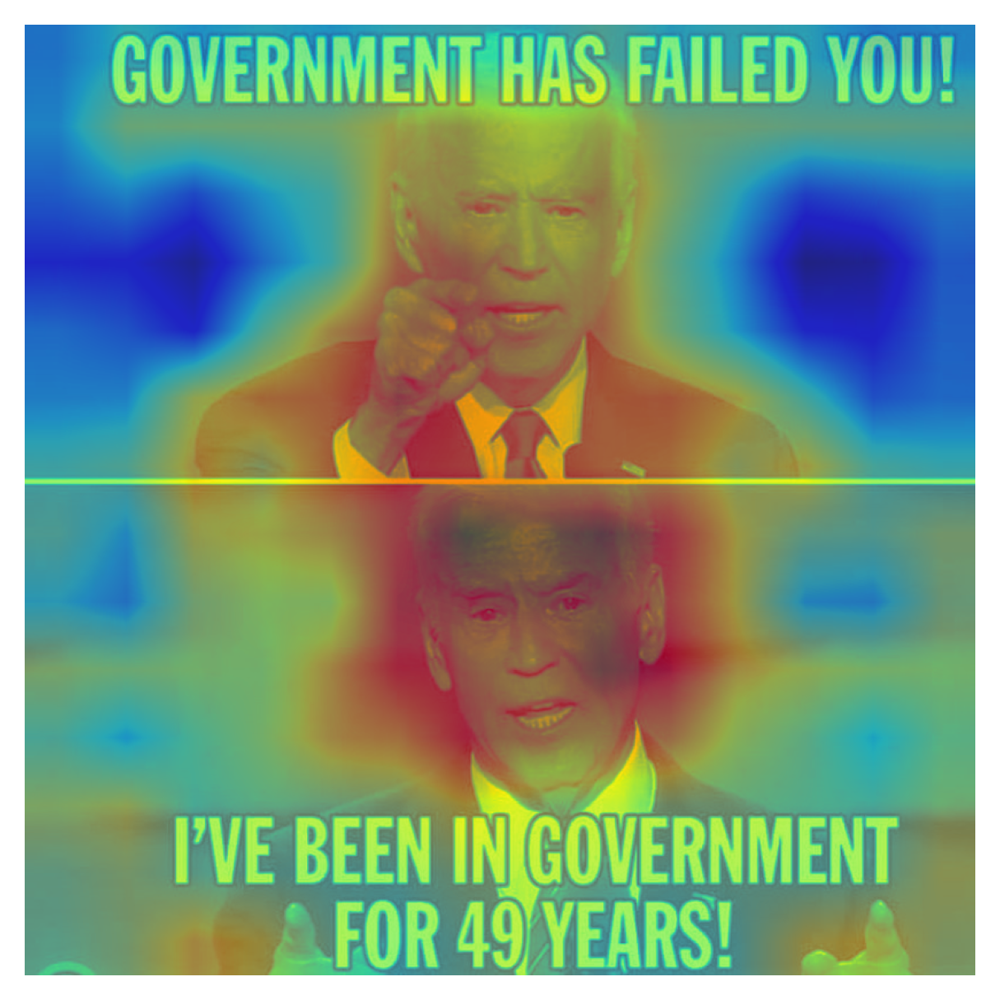
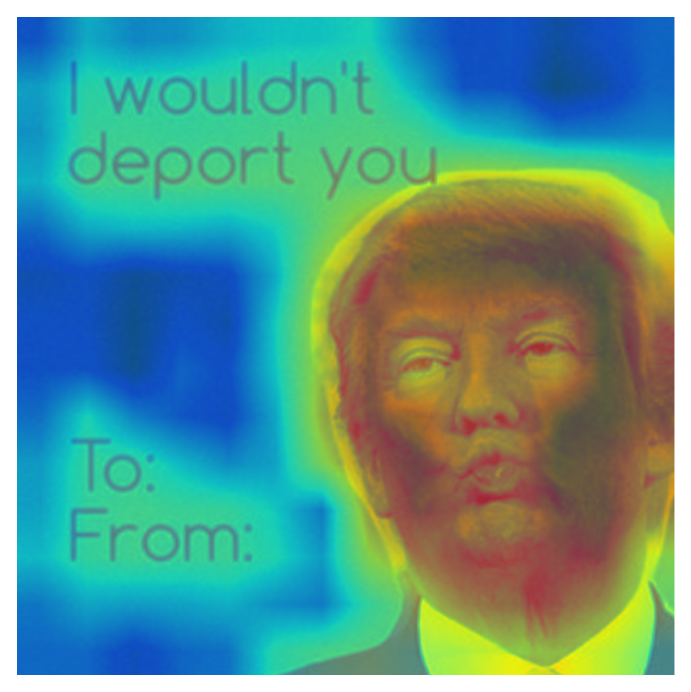
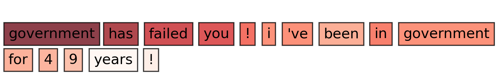
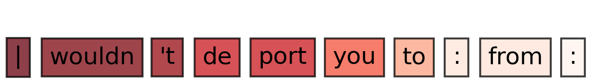

# CLIPping at Hate Speech

Deep learning EE-559 project, Spring 2025, EPFL

---

## Table of Contents

1. [Motivation](#motivation)
2. [Data](#data)
3. [Installation](#installation)
4. [Folder Structure of DL_vs_HateSpeech](#folder-structure-of-dl_vs_hatespeech)
5. [Report](#report)
6. [License](#license)
7. [Authors](#authors)

---

## Motivation
Detecting hate speech in memes is a complex and socially urgent challenge due to the nuanced interplay between visual and textual content. Unlike standard text or image classification, hateful memes often rely on subtle multimodal cues that are hard to interpret and model. This project proposes a transparent, interpretable pipeline by fine-tuning a CLIP model and integrating a transformer-based classifier. With the added use of Attention Rollout, the model not only predicts but also highlights which parts of the meme contribute most to its decision, paving the way for more explainable and ethically aligned AI systems in content moderation.

---

## Data
This folder contains the main codebase for the Deep Learning Against Hate Speech project. Below is an overview of the folder structure and the main functions/classes in each file. The memes dataset can be downloaded from: [Harmful Memes Dataset](https://drive.google.com/file/d/1aMvOHACrG5SgMl4tm9BP1VTiqv8zFn9b/view). The annotations, already included in the present repository, are located in [Harmful Memes Annotations](https://github.com/LCS2-IIITD/MOMENTA/tree/main) and specifically in `HarMeme_V1/Annotations/Harm-P`.


---

## Installation

Clone the repository and install dependencies:

```bash
>>> git clone https://github.com/MattiaBarbiere/Deep_Learning_against_hate_speech.git
```
Once cloned make sure you are in the folder containing `setup.py` and run the following command
```bash
>>> pip install -e .
```
The scirpt above should install all the requirements, if this is not the case you can run
```bash
>>> pip install -r requirements.txt
```

Ensure you have Python 3.10+ and a virtual environment activated.


Ensure you have Python 3.10+ and a virtual environment activated. Next clone the repository onto your local machine:

```bash
>>> git clone https://github.com/MattiaBarbiere/Deep_Learning_against_hate_speech.git
```
Once cloned, move to the folder containing `setup.py` and run the following command
```bash
>>> pip install -e .
```
You can remove the `-e` flag if you do not want to edit the `DL_vs_HateSpeech` module.

The scirpt above should install all the requirements, if this is not the case run
```bash
>>> pip install -r requirements.txt
```

---

## Folder Structure of DL_vs_HateSpeech

- **CLIP/**: Defines `AttentionCLIP`, a wrapper around HuggingFace CLIP with attention extraction and projection.

- **models/**: Model architectures used for the project.

- **plots/**: Functions for plotting training/validation loss and metrics curves, and loading them from disk.

- **attention_rollout/**: Contains scripts and utilities for visualizing attention maps and rollouts.

- **loading_data/**: Contains data loading utilities and dataset classes.

- **training/**: Contains training loops, optimizer/criterion setup, and collate functions.

- **evaluation/**: Contains evaluation functions for computing metrics.


For more details, see [DL_vs_HateSpeech/README.md](./DL_vs_HateSpeech/README.md) and docstrings in each file.

---

## Report

For the full report of the project, including some theoretical background and experimental analysis, visit [CLIPping_at_hate_speech.pdf](./CLIPping_at_hate_speech.pdf).

### Result examples
As an example below you find Attention Rollout results on images and text when using model V2_16 for two memes. A more intense red colour indicates influential regions/tokens to the classification token. 
<div style="overflow:auto; margin-bottom:3px; clear:both;">
    
    
    
    
</div>

<br>

Many other examples of Attention Rollout on both images and text are available in the [saved_images](./saved_images/) subfolder.

---

## License

This project is licensed under the **MIT License**. See the [LICENSE](LICENSE) file for more details.

---

## Authors

Developed by **Mattia Barbiere, Jacopo Boscariol, and Michele Lanfranconi** as part of the Deep Learning EE-559 course during the spring 2025 semester at EPFL.  
GitHub: [@MattiaBarbiere](https://github.com/MattiaBarbiere)\
GitHub: [@JackBosca](https://github.com/JackBosca)\
GitHub: [@MikyLanfra](https://github.com/MikyLanfra)

---